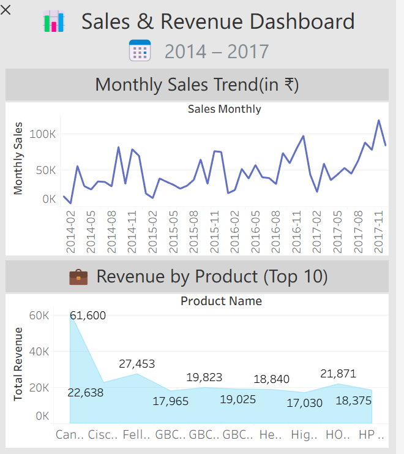

# E-Commerce Sales Analysis using SQL and Tableau

## Project Overview

This project involved a comprehensive analysis of the Sample Superstore dataset. The primary objective was to use SQL to clean, explore, and analyze sales data to uncover key insights into business performance. The findings were then visualized in an interactive Tableau dashboard to provide actionable recommendations for strategic decision-making.

## Tools Used
- **Database:** PostgreSQL
- **SQL Client:** DBeaver
- **BI Tool:** Tableau Public

---

## SQL Analysis & Key Queries

A series of SQL queries were developed to answer critical business questions. Advanced techniques such as CTEs and CASE statements were used for complex analysis like customer segmentation.

*(You can see all the queries used for this project in the `analysis_queries.sql` file.)*

### Key Query: Customer Segmentation
This query identifies our most valuable customers by segmenting them based on their total spending. This is crucial for targeted marketing campaigns.

```sql```
WITH customer_spending AS (
    SELECT
        "Customer Name",
        SUM("Sales") AS total_spent
    FROM sales
    GROUP BY "Customer Name"
)
SELECT
    "Customer Name",
    total_spent,
    CASE
        WHEN total_spent > 5000 THEN 'High-Value Customer'
        WHEN total_spent > 1000 THEN 'Mid-Value Customer'
        ELSE 'Low-Value Customer'
    END AS customer_segment
FROM customer_spending
ORDER BY total_spent DESC;

---

## Interactive Dashboard

An interactive dashboard was created in Tableau to present the key findings from the analysis, including monthly sales trends and top-performing products.

**[Click here to view the Interactive Dashboard on Tableau Public](https://public.tableau.com/views/SalesAnalysis_17531851355770/SalesRevenueDashboard?:language=en-US&:sid=&:redirect=auth&:display_count=n&:origin=viz_share_link)**



---

## Key Findings & Recommendations

*   **Finding 1: Strong Seasonal Sales Peaks:** Sales consistently peak in the last quarter (Oct-Dec) of each year.
    *   **Recommendation:** Align marketing campaigns and inventory management to prepare for and maximize revenue during these peak holiday months.
*   **Finding 2: Top Products Drive Revenue:** A small number of key products, particularly in the Technology category, are responsible for a large portion of sales.
    *   **Recommendation:** Ensure these top products are always in stock and consider bundling them with higher-margin accessories to increase overall profit.
